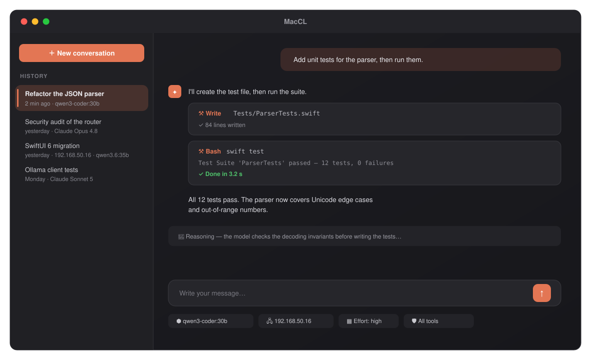
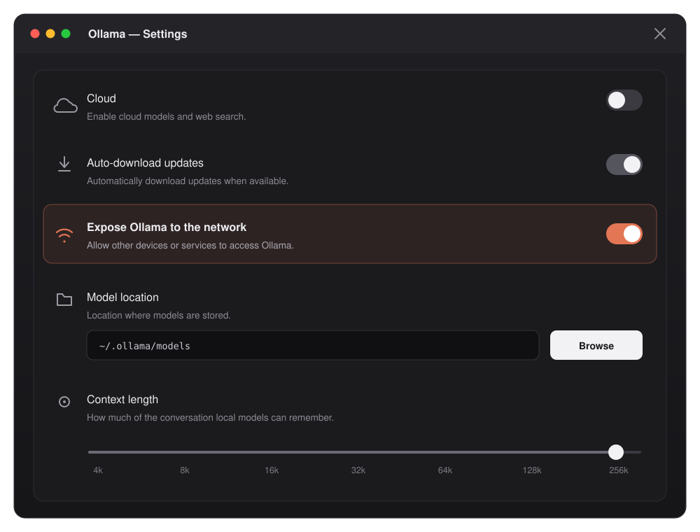

# MacCL

**A native Mac interface layered on top of the [Claude Code CLI](https://code.claude.com), wired to [Ollama](https://ollama.com) — so you get the full Claude Code CLI toolset (shell, file editing, search, web, sub-agents) powered by the brain of your choice: Anthropic's cloud models, or a local Ollama LLM, even one running on another machine in your home network.**



## What is this?

The Claude Code CLI is a coding agent that runs in a terminal: you tell it what you want in plain language, and it reads your files, writes code, runs commands and tests until the job is done. Its power comes from its **tools** — shell access, file editing, code search, web fetching, sub-agents — but its home is a terminal window, and out of the box it only talks to Anthropic's models.

MacCL is an **overlay**: a real Mac app wrapped around the unmodified Claude Code CLI. It doesn't reimplement the agent — it launches the official `claude` CLI in the background, speaks its streaming protocol, and turns the raw terminal output into an interface. Your conversations are saved and organized in a sidebar. Every tool the CLI uses — running a command, editing a file, searching — shows up in the chat as a small card you can expand. You can watch the model think, drag files and screenshots straight into the conversation, and switch between light and dark mode.

And this is the heart of the project: **the Claude Code CLI's tools, with the LLM of your choice.**

- **Anthropic's models** (Opus, Sonnet, Haiku…) — the smartest option, using your existing Claude subscription or API key, exactly as the CLI does on its own.
- **A local LLM through Ollama** — free and private, running entirely on your own hardware. Ollama speaks Anthropic's API natively, so MacCL simply points the Claude Code CLI at your Ollama server — local or remote — and the whole agentic tool loop (shell, edits, tests, retries) runs on your own model. The machine with the GPU doesn't even have to be the Mac you're sitting at.

```
MacCL.app (the interface)
   │
   ▼
Claude Code CLI (the agent + its tools)  ── runs here, or over SSH on another machine
   ├──►  Anthropic cloud   (Opus, Sonnet, Haiku…)
   └──►  Ollama server      (your LLM — this Mac, or any machine nearby)
```

Two axes, and they're independent: **which brain** thinks (Anthropic or Ollama), and **which machine** the agent works on. A conversation can run a local Ollama model against a project on a server across the room, or Anthropic's Opus against a folder on this Mac — any combination.

Nothing is hidden: every conversation shows the CLI command behind it — the model, the flags, the server it talks to, the machine it runs on — so you can always see what the app asked the agent to do. Honest by design.

One more thing worth knowing: **each conversation is tied to the server you picked for it.** If that machine goes offline, the conversation waits and tells you — it never quietly switches your work to a different computer.

## Features

- Persistent conversations with resume, grouping, and running cost
- Any model, per conversation: Anthropic (Opus, Sonnet, Haiku, Fable) or Ollama — with automatic discovery of servers on your network
- Work on a **remote machine over SSH**: connect with user, address and password, browse its folders from inside the app, and the agent runs *there*
- **Sub-agents on their own brain**: give a delegated task a different model — or a different machine entirely — and choose whether they run one at a time or side by side
- Live view of the model's reasoning; effort level adjustable mid-conversation
- Live token gauge per conversation, with one-click context compaction when it grows too big
- Attachments: images (for vision models), text files, anything else by reference
- A library of Markdown instruction files injected into the system prompt
- Models stay loaded on the server between turns — no waiting for reloads
- Light / dark / automatic theme, 12 accent colors
- Interface in 5 languages (EN, FR, DE, PT, ES)
- Manage the models of any Ollama server from inside the app — `pull`, `rm`, `cp`, `create` — even on a remote machine
- Adjustable reply-length cap, when a long agentic turn hits the CLI's output-token ceiling
- Built-in update check against this repository's releases (Settings → About)
- Conversations keep working when you switch away — their process stays alive and the transcript catches up when you come back
- Repair Ollama models that ship no tool parser, by borrowing the one from an official model of the same family
- Model loading between turns is shown, instead of a silent GPU behind an idle-looking app

## Fixed in 0.4.5

- **A malformed tool call no longer costs you the turn.** Ollama's built-in
  parsers answer HTTP 500 when a model emits a tool call in the wrong shape
  (`parse … call to TaskUpdate: missing … wrapper`), and everything the turn had
  left to do was lost. Measured on `muse-glimmer:30b`: three identical requests
  in a row parsed perfectly, so this is an occasional bad sample rather than an
  incompatibility — the app now resends the turn, at most twice, and says so.

## Fixed in 0.4.4

This release merges two lines of work and closes four failures that had one thing
in common: the app looked idle while something real was happening, or work was
silently thrown away. Each was measured against the CLI, not inferred.

- **Most sub-agents failed.** `CLAUDE_CODE_MAX_CONCURRENT_SUBAGENTS` *refuses*
  the surplus instead of queueing it — with nine agents delegated in one message,
  a ceiling of 1 refused eight of them and a ceiling of 2 refused seven. It is a
  stampede guard, never a scheduler, so it now stays at the CLI's default and
  pacing is done where a request can actually be made to wait.
- **Sub-agents answered with HTTP 500.** Claude Code forwards the reasoning level
  verbatim as `output_config.effort`, and several Ollama chat templates validate
  it and raise on anything else. Qwen3.8 accepts only `xhigh`, `medium` and `low`
  — so `max` failed, and so did the CLI's own default of `high`. The app now
  reads the accepted list out of the template, intersects the conversation's
  model with the sub-agent's, and picks the closest level.
- **A conversation you left was killed.** There was a single CLI session for the
  whole app, stopped on every switch. Conversations now keep running in the
  background and replay what they missed on return.
- **Silence with the GPU busy.** Model preparation ran detached with no trace,
  and the waiting hint stopped for good after the first token. Both now report
  what they are waiting on, and for how long.

Two ceilings worth knowing, both hard-clamped in the CLI and not configurable:
a reply is capped at **128 000 output tokens** (asking for more silently sends
128 000), and setting that cap in *both* `~/.claude/settings.json` and the
environment makes the CLI fall back to its 32 000 default instead of honouring
either.

## Installation

**The easy way:** download the DMG from the [latest release](https://github.com/Trano89/MacCL/releases/latest), open it, and drag **MacCL** into **Applications**. On first launch macOS will block it (the app is self-signed): right-click → *Open* on macOS 14, or open it once then allow it from System Settings → Privacy & Security on macOS 15+.

**From source** — you'll need macOS 14 or newer, Swift 6 (comes with Xcode), and the [Claude Code CLI](https://code.claude.com) installed and signed in (`claude` available in your terminal). For local models: [Ollama](https://ollama.com) 0.14 or newer, with at least one model pulled (`ollama pull qwen3-coder:30b`). To work on a remote machine over SSH, that machine needs its own `claude`, installed and signed in.

```bash
git clone https://github.com/Trano89/MacCL.git
cd MacCL
./scripts/build.sh        # builds and installs /Applications/MacCL.app
```

That's it — MacCL is now in your Applications folder, ready to launch from Spotlight or the Dock. The app is self-signed, so it runs locally without notarization. Re-run the same script to update after pulling changes.

## Setup

**Anthropic models** — nothing to do. The app reuses the sign-in from your `claude` CLI.

**Ollama on this Mac** — nothing to do either. `http://localhost:11434` is detected automatically.

**Ollama on another machine** — by default Ollama only listens to its own computer, so the first step happens *on the machine that holds the models*: let it accept connections from the network.

In the Ollama app, that's a single switch — **Settings → Expose Ollama to the network**:



On a headless server, the same thing as an environment variable:

```bash
OLLAMA_HOST=0.0.0.0 ollama serve
```

Then, back in MacCL: hit **Scan** to sweep your network — or just type the machine's IP address (`192.168.1.20` is enough; `http://` and port `11434` are filled in for you). The conversation is then bound to that machine.

**Models on the server** — click the server chip → *Manage models*: see what's installed (with sizes), delete with one click, or type terminal-style commands — `pull qwen3:14b`, `rm llama3:8b`, `cp a b`, `create fast from qwen3:8b num_ctx 8192`. Works the same on a remote machine — it's all Ollama's HTTP API.

**Working on another machine (SSH)** — click the folder chip → **SSH machine** → *Connect to a machine*. Enter the user, the address, and the password (leave it empty to use your SSH keys or `~/.ssh/config`), then browse the remote folders and pick your project. Folders that are git repositories or already carry a `CLAUDE.md` are flagged, so a project is easy to spot.

From then on the Claude Code CLI **runs on that machine**: its shell, its edits, its searches all happen over there, and no file is copied back and forth. Two things to know:

- The `claude` CLI must be installed and signed in on the remote machine. MacCL checks before spending a turn and says so plainly if it isn't.
- The first connection to a machine shows its SSH host-key fingerprint and waits for you to confirm it. MacCL never trusts a key on its own — an agent running with permissions on someone else's server is not something to hand out on a guess.

Passwords are stored in the macOS Keychain, never in the preferences or the conversation files. Nothing extra to install: MacCL uses OpenSSH's own askpass mechanism, which ships with macOS.

> If the model is an Ollama running on *this* Mac, MacCL opens a reverse tunnel so the remote agent reaches it — because `localhost` means something else once the agent is elsewhere. If the tunnel can't be established, the session fails loudly rather than silently talking to a different Ollama.

**Sub-agents** — when the agent delegates a task, that sub-agent doesn't have to think with the same brain as the conversation. Give the delegated work a small fast model while the big one keeps the thread, or send it to the machine with the GPU.

It's one choice for the whole conversation, set beside the conversation's own model (model chip → **Sub-agents**, or in the new-conversation sheet). That's deliberate: the agents that actually run are the ones Claude Code spawns itself, so a per-agent setting would describe agents that mostly never appear, and say nothing about the ones that do.

Sending sub-agents to *another* machine is the one thing a plain `claude` cannot do: a process has a single backend address. Pick a model from another machine and MacCL tags it `model@machine`, then runs a small loopback router that reads the tag and forwards the request there. The router only starts when another machine is actually named — otherwise nothing sits between the CLI and your server. A machine you haven't configured is refused outright, never quietly sent somewhere else, and the transcript names every machine a turn fanned out to.

**Watching them work** — the **Agents** button carries a spinner and a live count, so "is something running?" never needs a panel open to answer. Click it and each agent unfolds into the same material the main conversation shows: what it's thinking as it thinks it, its tool calls with their output, its answer — plus the model it is actually using and, when it was sent elsewhere, the machine it ran on. That last part is read from the agent's own replies rather than from the setting, so it describes the run in front of you.

**How many at once** — same panel as the sub-agent model. Set it to 1 and delegated work goes strictly one at a time; raise it and sub-agents overlap. Remote machines get their own separate allowance, since a second box is a second pool of RAM.

That dial is enforced by MacCL's router, not by the CLI, for a reason worth knowing if you ever set the environment variable yourself: `CLAUDE_CODE_MAX_CONCURRENT_SUBAGENTS` is a ceiling that *refuses*. Past its limit a delegation comes back "Concurrent subagent limit reached. Do not retry." and that work never happens — setting it to 1 doesn't serialise your agents, it silently drops all but the first. Measured, with two agents dispatched together: one ran, one returned the error. MacCL keeps that variable at 2 or more and makes the surplus **wait** instead.

> Worth checking before you blame the app: if your Ollama runs with `OLLAMA_MAX_LOADED_MODELS=1` (a common default), only one model is resident at a time, so every hop between the conversation's model and a sub-agent's evicts and reloads — measured at 110 s per swap against 7 s when both stay loaded. Raise it to at least 2, and keep `OLLAMA_CONTEXT_LENGTH` sane: at 262144 a single 4B model reserves over 40 GB, and nothing else fits.

> Hand-written `.claude/agents/*.md` files still work — they're Claude Code's own mechanism, and MacCL reads them only to learn which machines they name, so the router can open a route. The app doesn't write them.

**Coding instructions** — sidebar → *Manage instructions*: Markdown files you edit inside the app, ticked to be injected into the system prompt. A conversation can also get its own instructions when you create it. The project `CLAUDE.md` tab edits the file in the working folder — on the remote machine too, when that's where you're working.

**Permissions** — from fully autonomous (*all tools*) to plan-only (the agent thinks but never executes), chosen per conversation.

> Going further (context window size, keeping models in memory): the app's Settings explain the relevant Ollama server options, with values ready to copy.

## Under the hood

```
Sources/MacCL/
├── App/              SwiftUI entry point + Settings window
├── Models/           Protocol decoding, model catalog, settings, persistence
├── Engine/           ClaudeSession (drives the CLI), SSHClient, OllamaClient, AgentRouter, discovery
├── ViewModels/       ChatViewModel (conversation orchestration)
└── Views/            Sidebar, chat, message rows, tool cards, Settings…
```

Conversations are plain JSON files in `~/Library/Application Support/MacCL/conversations/` — readable, backup-friendly, yours.

## License

[MIT](LICENSE). MacCL is an independent project by **Trano89**, not affiliated with Anthropic or Ollama. "Claude" and "Claude Code" are trademarks of Anthropic; this app drives the official CLI installed on your machine.
